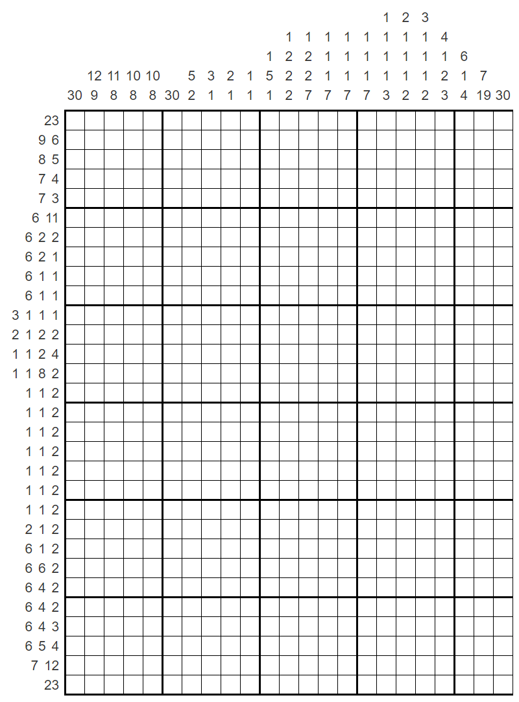
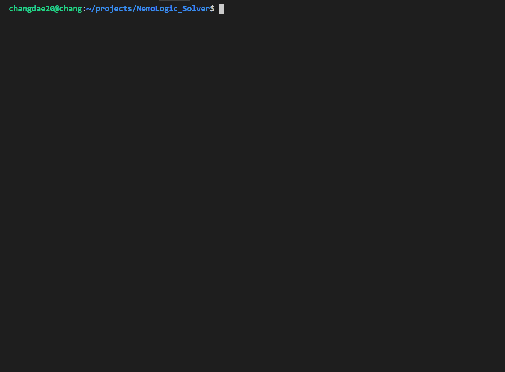
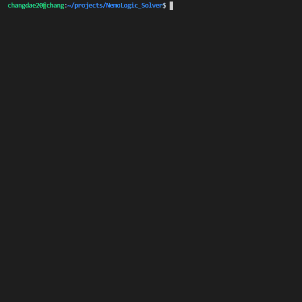

# NemoLogic(Nonogram) Solver 


|         |`Clang-Format`  |`Build`     | 
| :---:   |      :---:     | :---:      |
| **Status** | [](https://github.com/changdae20/NemoLogic_Solver/actions) | [](https://github.com/changdae20/NemoLogic_Solver/actions) |


<br>

C++로 구현한 간단한 네모로직(노노그램) 솔버입니다. 네모로직(노노그램)에 대한 설명은 [링크](https://namu.wiki/w/%EB%85%B8%EB%85%B8%EA%B7%B8%EB%9E%A8)를 참조해주세요.

<br>

# How to run

해당 프로그램은 C++14이상의 문법을 사용합니다. 컴파일 시 C++14이상을 사용해주세요.

g++로 빌드하는 경우 다음과 같은 명령어로 컴파일 및 실행할 수 있습니다.

```
$ git clone https://github.com/changdae20/NemoLogic_Solver.git
$ cd NemoLogic_Solver
$ g++ -std=c++17 -o main -O3 main.cpp
$ ./main
```

<br>

# Input

입력은 board.txt를 통해 주어집니다.

첫째 줄에는 행의 수 row와 열의 수 col가 주어집니다. row와 col는 공백 한 칸으로 구분되어져 있습니다.

두번째 줄부터 row+1번째 줄까지는 상단에서 하단의 순서로 해당 행의 힌트들이 공백 한 칸으로 구분되어져 주어집니다. 이때 주어지는 각 힌트들은 네모로직(노노그램)의 조건을 만족합니다.

row+2 줄부터 row++col+1번째 줄까지는 좌측에서 우측의 순서로 해당 열의 힌트들이 공백 한 칸으로 구분되어져 주어집니다. 이때 주어지는 각 힌트들은 네모로직(노노그램)의 조건을 만족합니다.

**위의 조건을 만족하지 않는 입력의 경우에 대한 예외처리는 되어있지 않습니다.**

자세한 입력은 [예시](examples/)를 확인하세요. [어몽어스 예시](examples/amongus.txt)는 아래와 같은 보드를 나타냅니다. [[출처](http://nemonemologic.com/play_logic.php?quid=16080)]



<br>

# Output

크기가 작은 보드(~ 30 x 30)는 대략 1초안에 해결하며,

크기가 커질 수록 기하급수적으로 시간 및 메모리를 소비합니다.

아래는 예시에 대한 출력 결과입니다.





# License

**The MIT License (MIT)**

**Copyright (c) 2022 changdae20.**